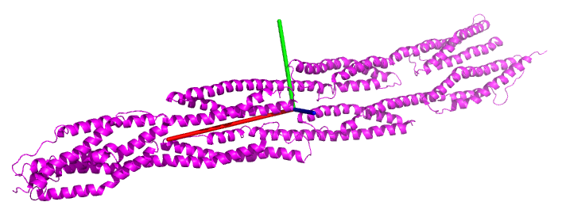

Principal axes
==============

This program reads a .pdb file, computes principal axes and produces a .pml PyMoL script to view axes.

Note that only C-alpha atoms are read and that the .pdb file must only contain a single *coherent* protein structure.


## Example

with the cryo-EM structure of chicken gizzard smooth muscle alpha-actinin ([1SJJ](http://dx.doi.org/10.2210/pdb1sjj/pdb) from the [Protein Data Bank](http://www.rcsb.org/pdb/home/home.do)):

```text
    ./principal_axes.py  1SJJ.pdb
```

```text
    950 CA atomes found if 1SJJ.pdb
    Coordinates of the geometric center:
    [-107.35616421  -44.75738526    8.11289053]
    (Unordered) eigen values:
    [ 4854301.51173111   111627.33781935    52235.74662753]
    (Unordered) eigen vectors:
    [[-0.85667497 -0.50720869  0.09406029]
     [-0.51289152  0.81795036 -0.26057532]
     [-0.05522942  0.27147108  0.96086064]]
    Inertia axis are now ordered !
    The first principal axis is in red
    coordinates:  [-0.85667497 -0.51289152 -0.05522942]
    eigen value:  4854301.51173

    The second principal axis is in green
    coordinates: [-0.50720869  0.81795036  0.27147108]
    eigen value: 111627.337819

    The third principal axis is in blue
    coordinates: [ 0.09406029 -0.26057532  0.96086064]
    eigen value: 52235.7466275

    You can view principal axes with Pymol:
    pymol 1SJJ_axes.pml 1SJJ.pdb
```



## History

The first version of this script had been posted in the Biostar forum as an answer to [Question: Protein 3D structure principal axes](http://www.biostars.org/p/7393/)
